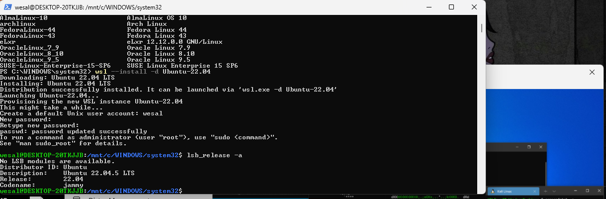
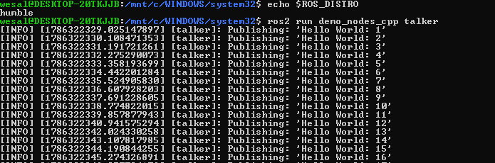

# ROS2-Linux-Setup
## Overview

This project documents the installation and setup of a Linux environment and ROS 2 Humble using WSL2 on Windows 11.

The main goal of this task was to install Ubuntu Linux, configure ROS 2 Humble, and verify that ROS 2 is working correctly.

## Environment

- Operating System: Windows 11
- Linux Environment: WSL2
- Linux Distribution: Ubuntu 22.04 LTS
- ROS Version: ROS 2 Humble

## 1. Installing WSL2

WSL2 was installed on Windows 11 using PowerShell.

The following command was used:

wsl --install

After the installation, the computer was restarted to apply the required changes.

WSL2 was then configured as the default version:

wsl --set-default-version 2

## 2. Installing Ubuntu 22.04

Ubuntu 22.04 was installed through WSL2.

After the installation, a default UNIX user account was created.

The Ubuntu version was verified using:

lsb_release -a

The system confirmed that Ubuntu 22.04 LTS was installed.

### Ubuntu 22.04

## 3. Preparing Ubuntu

The Ubuntu system was updated and upgraded before installing ROS 2.

sudo apt update

sudo apt upgrade -y

The required package was installed:

sudo apt install software-properties-common -y

The Ubuntu Universe repository was enabled:

sudo add-apt-repository universe

## 4. Installing ROS 2 Humble

The required ROS 2 tools were prepared using:

sudo apt update && sudo apt install curl -y

The ROS 2 repository key was added using:

sudo curl -sSL https://raw.githubusercontent.com/ros/rosdistro/master/ros.key -o /usr/share/keyrings/ros-archive-keyring.gpg

The ROS 2 repository was then added and the package lists were updated.

ROS 2 Humble Desktop was installed using:

sudo apt install ros-humble-desktop -y

The installation took some time because ROS 2 Desktop contains many packages and dependencies.

## 5. Configuring ROS 2

ROS 2 Humble was added to the Ubuntu environment so that it can be loaded automatically whenever Ubuntu starts.

echo "source /opt/ros/humble/setup.bash" >> ~/.bashrc

The configuration was then loaded:

source ~/.bashrc

## 6. Verifying ROS 2 Humble

The ROS 2 command-line interface was tested using:

ros2 --help

The installed ROS distribution was checked using:

echo $ROS_DISTRO

The output was:

humble

This confirmed that ROS 2 Humble was installed and configured successfully.

### ROS 2 Humble Verification

## 7. Testing ROS 2

To verify that ROS 2 was functioning correctly, the ROS 2 demo talker node was executed:

ros2 run demo_nodes_cpp talker

The program successfully published messages such as:

Publishing: 'Hello World: 1'
Publishing: 'Hello World: 2'
Publishing: 'Hello World: 3'

The program was stopped using:

Ctrl + C

### ROS 2 Talker Test

## 8. Problems Encountered

During the installation and setup, several issues were encountered.

### WSL Optional Component

At the beginning, WSL displayed a message indicating that the Windows Subsystem for Linux optional component needed to be enabled.

The required Windows features were enabled, and the computer was restarted so that the changes could take effect.

After restarting, WSL2 was successfully configured and the default version was confirmed as:

Default Version: 2

### ROS 2 Version Command

When checking the ROS 2 version, the following command was initially used:

ros2 --version

This resulted in an error.

Instead, ROS 2 was successfully verified using:

ros2 --help

and:

echo $ROS_DISTRO

The output was:

humble

This confirmed that ROS 2 Humble was working correctly.

### Installation Time

The installation of ROS 2 Humble Desktop took some time because it required downloading and installing many packages and dependencies.

## 9. Final Result

The Linux and ROS 2 environment was successfully installed and configured.

The final setup consists of:

- Windows 11
- WSL2
- Ubuntu 22.04 LTS
- ROS 2 Humble

ROS 2 was successfully tested using the talker demo node, which published Hello World messages.

This confirms that the ROS 2 environment is working correctly.

## Author

**Wesal Ibrahim Alsharif**

CS Student at Taif University
